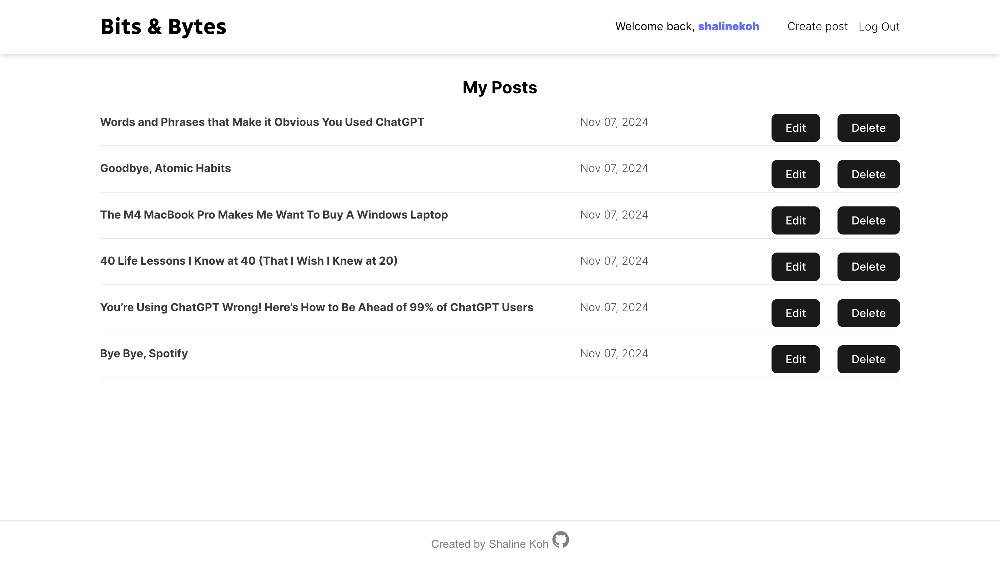

# Bits & Bytes Blog Platform

A blogging platform where users can create, read, edit, and delete posts. The platform also includes a user profile page to view and manage personal posts, a homepage showcasing the latest posts, and a featured "Today's Pick" section with a random selection of blog entries.

This is the frontend of the application.

## Links

- <a href="">Live Demo (may take some time to load)</a>
- <a href="https://github.com/shalinekoh/blog-api">Backend repository</a>

## Features

- **User Authentication**: Sign up, log in, and log out functionality.
- **Create & Manage Posts**: Logged-in users can create new posts with title, description, content, and optional image upload.
- **Rich Text Editor**: Create and edit blog posts with TinyMCE, allowing for rich text formatting and image uploads.
- **User Profiles**: Each user has a profile page that supports CRUD operations to create, view, edit, or delete their posts.
- **Homepage**: Displays a list of all blog posts with random featured posts in "Today's Pick" section.
- **Post Details**: Each post includes information about the author, date, description, and content.
- **Protected Routes**: Access to certain pages (e.g., post creation and profile) requires authentication.
- **Dynamic Error Handling**: Provides users with meaningful error messages on unsuccessful actions.

## Tech Stack

- **Frontend**: React, React Router
- **Backend**: Node.js, Express
- **Database**: PostgreSQL, managed by Prisma ORM
- **Authentication**: JSON Web Tokens (JWT) stored in localStorage for persistent login and authentication.
- **File Uploads**: Multer for image uploads, integrated with Cloudinary for cloud storage
- **Validation**: Express-validator for form validation
- **Styling**: CSS
- **Other Dependencies**: dotenv for environment configuration, bcryptjs for password hashing, and cookie-parser for handling cookies

## Screenshots

